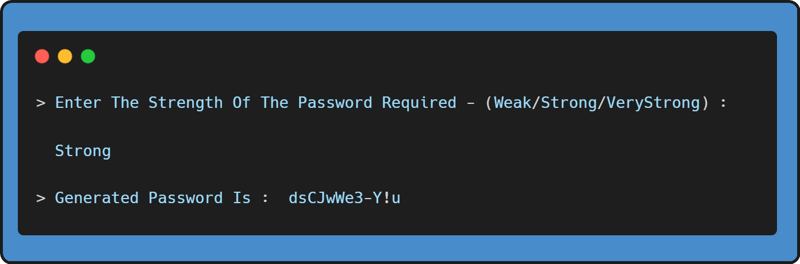
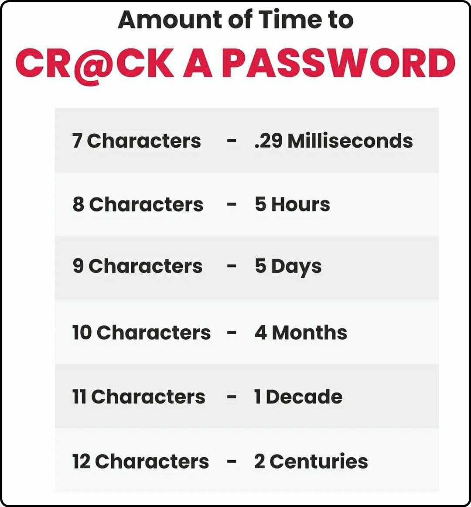

## 🔄 WorkFlow Of Program :

<h3>Generating A Strong Password:</h3>

---
> **Password Generator:**  [**Webpage**](https://gkrockz.github.io/Python-Scripts/Password-Generator/webpage/)
---

### Choose the password length wisely, as per the info given below:
 
